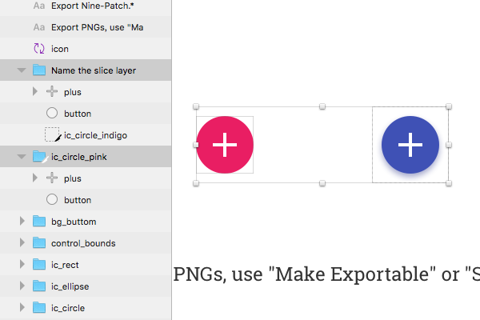
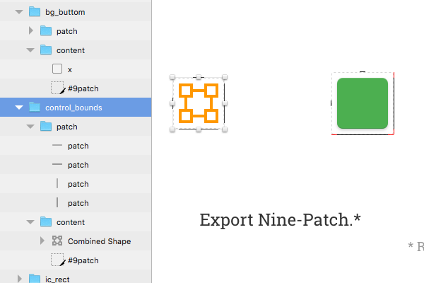
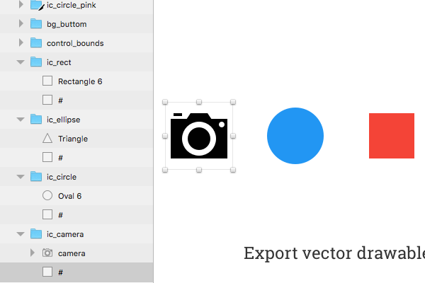

# Android Res Export

[中文说明](https://github.com/Ashung/Android_Res_Export/blob/master/README_zh.md)

Export Android resouces in Sketch, include PNG assets, app icon, nine-patch image and vector drawable.

## Installation

1. [Download](https://github.com/Ashung/Android_Res_Export/releases) and unzip.
2. Double-click "Android_Res_Export.sketchplugin" to install.
3. Install [ImageMagick](http://www.imagemagick.org/script/index.php) via [Homebrew](http://brew.sh/).
   ```bash
   brew install imagemagick
   ```
4. Install [Node.js](https://nodejs.org/en/) and [SVGO](https://github.com/svg/svgo).
   ```bash
   sudo npm install svgo -g
   ```

## How it Works

Download [demo.sketch](https://raw.githubusercontent.com/Ashung/Android_Res_Export/master/demo.sketch)

1. Design at MDPI (1x) size, NOT support other sizes.
2. Use "Make Exportable" or "Slice" to export PNGs.
   
3. Nine-patch group must have 2 groups inside which named with "path" and "content", in "content" group add a slice with name "#9patch".
   
4. Vector drawable group must have a rect layer name with "#".
   
5. Export asset to other qualifier folder.
   

## License

CC-BY-SA 4.0

[](http://creativecommons.org/licenses/by-sa/4.0/)