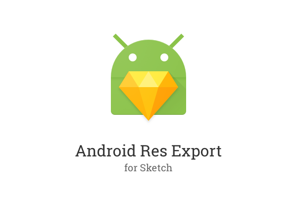
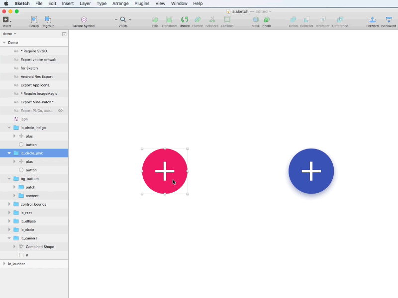
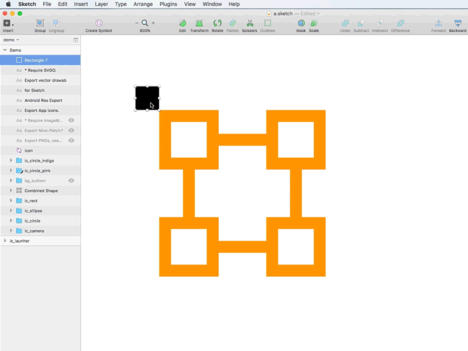

# Android Res Export



**Sketch 43.x Support**

[中文说明](https://github.com/Ashung/Android_Res_Export/blob/master/README_zh.md)

Export Android resources in Sketch – PNG assets, app icon, nine-patch image and vector drawable.

## Installation

### Install plugin

- Download [master.zip](https://github.com/Ashung/Android_Res_Export/archive/master.zip) and unzip, then double-click "Android_Res_Export.sketchplugin" to install.
- Search "Android Res Export" from [Sketch Runner](http://sketchrunner.com/), [Sketchpacks](https://sketchpacks.com/) or [Sketch Toolbox](http://sketchtoolbox.com/).

### Nine-patch support configure 

Install [Homebrew](http://brew.sh/), after hombrew installed, use this command to install ImageMagick.

```bash
$ brew install imagemagick
```

### Vector drawable support configure

Install [Node.js](https://nodejs.org/en/), then use this command to install [SVGO](https://github.com/svg/svgo) and [svg2vectordrawable](https://github.com/Ashung/svg2vectordrawable).

```bash
$ npm install -g svgo svg2vectordrawable
```

## How it Works

Download [demo.sketch](https://raw.githubusercontent.com/Ashung/Android_Res_Export/master/demo.sketch)

Design at MDPI (1x) size, NOT support for other sizes.

Use menu "Plugins" - "Android Res Export" - "New PNG Asset" to create PNG assets.



Use menu "Plugin" - "Android Res Export" - "New Nine-Patch Asset" to create a nine-patch asset.



Use menu "Plugin" - "Android Res Export" - "New Vector Drawable Asset" to create a vector drawable asset. Select the shape layers in vector drawable group, click the settings icon in fill property panel, and choose "Non-Zero", then apply "Layer" - "Paths" - "Reverse Order" command from the main menu to reverse the path order.


Use page name to export asset in different folder.

```
@land-xxhdpi, land-xhdpi
@nodpi
@zh-rCN-xxhdpi
@sw600dp-xxhdpi
```

## License

CC-BY-SA 4.0

[](http://creativecommons.org/licenses/by-sa/4.0/)

## Donate

Donate [$1.00](https://www.paypal.me/ashung/1), [$2.00](https://www.paypal.me/ashung/2), [$5.00](https://www.paypal.me/ashung/5) via PayPal.
