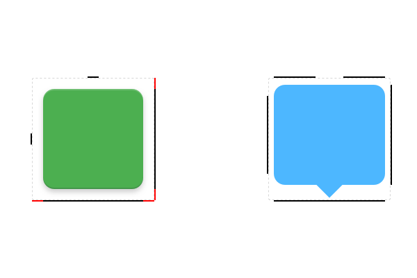

# Android Res Export


**支持 Sketch 41**

用于导出 Android 各种资源的 Sketch 插件，包括 PNG 资源、App 图标、点九图和 vector drawable XML 文件。

## 安装步骤

### 安装插件

1,  [下载 zip](https://github.com/Ashung/Android_Res_Export/archive/master.zip) 并解压。

2, 双击 "Android_Res_Export.sketchplugin" 文件，安装插件。

> 本插件支持使用 Sketch Toolbox 安装，请搜索 “Android Res Export”。

### 配置

插件安装完成后只支持导出普通资源和应用图标资源，需要安装以下工具才可以使用点九和 Vector Drawable 导出。

1, 使用 [Homebrew](http://brew.sh/index_zh-cn.html) 安装 [ImageMagick](http://www.imagemagick.org/script/index.php)。打开终端，粘贴 [Homebrew](http://brew.sh/index_zh-cn.html) 主页上的代码后，按下回车。安装完毕之后，在终端输入以下命令安装 ImageMagick。

```bash
brew install imagemagick
```

2, 首先从 [Node.js](https://nodejs.org/en/) 官网下载安装包，按照安装向导安装 Node.js。安装完成后，打开终端输入以下命令安装 [SVGO](https://github.com/svg/svgo)。

```bash
sudo npm install svgo -g
```

## 如何使用

> **注意**
>
> 设计稿必须是 MDPI (1x) 尺寸, 目前不支持以后也不会支持其他尺寸的设计稿。
>
> 下载演示文件 [demo.sketch](https://raw.githubusercontent.com/Ashung/Android_Res_Export/master/demo.sketch)。

### 普通资源

普通的 PNG 资源使用 "Make Exportable" 或者添加切片的方式来表示此图层将会被导出。或者选择图层，然后执行 "Plugins" - "Android Res Export" - "New" - "PNG Asset"，来创建一个可以导出的 PNG 资源，请增加辅助图层来表示切图区域。

资源命名基于 Exportable 图层名称或切片图层的名称。


### 点九资源

选择图层，然后执行 "Plugins" - "Android Res Export" - "New" - "9-Patch Asset"，来创建一个点九资源，可能需要增加图层来表示切图区域。

在 “patch” 组内修改图层 “left”、“right”、“top” 和 “bottom” 的宽或高。

资源命名基于 “path” 和 “content” 图层组的上一级图层组名称。“path” 组下的图层可以任意命名，“content” 组下的切片图层必须命名为 “#9patch”。复制组时请重新修改被重命名的切片图层。


插件支持以下较复杂的点九，请放心使用。



### Vector Drawable 资源

选择图层，执行 "Plugins" - "Android Res Export" - "New" - "Vector drawable Asset"，来创建一个 Vector Drawable 资源。

选择 Vector Drawable 资源组内所有的形状图层，在属性面板的填充中点击设置图标，选择 "Non-Zero"，如果图像有问题，可以执行 "Layer" - "Paths" - "Reverse Order" 反转路径顺序。

组内的白色 “#” 图层表示切图区域，最终导出的代码中不会包含此图层。


### App 图标资源

App 图标必须在 192x192px 的画板内。App 图标则命名在画板上。

### 导出资源

执行 "Plugins" - "Android Res Export" - "Export" 下的相应菜单导出资源。

导出普通资源和点九资源时，在执行之前，如果文档有选中的图层，则只会导出选中的内容，否则将导出当前页面中的所有资源。导出 App 图标 和 Vector drawable 则必须要求选中需要导出的画板或图层。

部分不合法的字符会被替换为下滑线。被修改和重复的资源命名，在导出时会保存到资源目录下的 "report.txt" 文件内，资源目录位于当前文档的同级目录下。

需要导出到特殊后缀的文件夹。可以将文件夹的前缀写在分页的命名上，以 "@" 开头，多个文件夹使用 "," 分隔。

```
@land-xxhdpi, land-xhdpi
@nodpi
@zh-rCN-xxhdpi
@sw600dp-xxhdpi
```


## 声明

CC-BY-SA 4.0

[](http://creativecommons.org/licenses/by-sa/4.0/)

## 捐助

使用微信或支付宝捐助作者。


